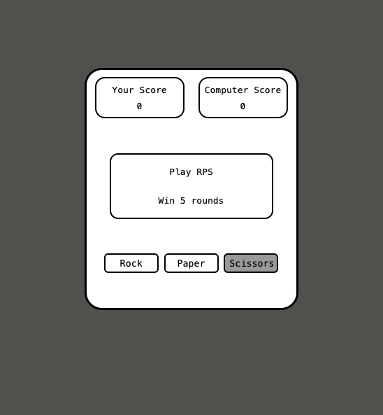

# Rock Paper Scissors

A browser-based Rock Paper Scissors game where you go head-to-head against the computer. First to 5 wins takes it all.

**[Play it live](https://kondrashar.github.io/Rock-Paper-Scissors/)**



## How It Works

Pick **Rock**, **Paper**, or **Scissors** — the computer picks randomly. Each round shows the result with emoji matchups (🪨 📄 ✂️) and color-coded feedback: green for a win, red for a loss or draw. Scores update live, and the game automatically resets after someone hits 5.

## Built With

- HTML
- CSS
- JavaScript

## Run Locally

Clone the repo and open `index.html` in your browser — no build step or dependencies needed.

```bash
git clone https://github.com/KondraShar/Rock-Paper-Scissors.git
cd Rock-Paper-Scissors
open index.html
```

## Project Structure

```
├── index.html       # Game layout and structure
├── styles.css       # Styling and visual feedback
├── rps-game.js      # Game logic and DOM interaction
├── rps-game.png     # Screenshot
└── rps-ui-design.png # UI design reference
```